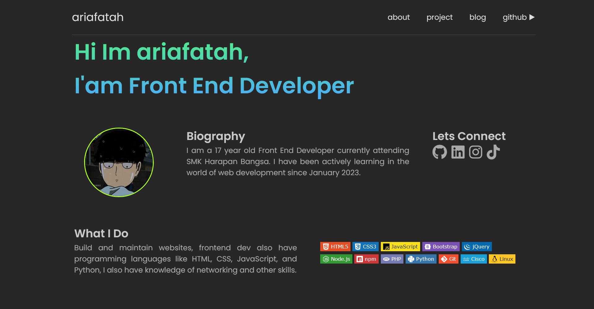

# portofolio_v.2

My Portofolio V.2

<p align="center">
  <a href="#introduction">introduction</a> •
  <a href="#table-of-contents">table of contents</a> •
  <a href="#download">Download</a> •
  <a href="#related">Related</a> •
  <a href="#license">License</a>
</p>

<p id="introduction"></p>

## 🚀 introduction
This is the second version of my web portfolio, crafted with HTML, CSS, and JS. The site consists of multiple pages, including About, Projects, and Blog. Drawing inspiration from a Figma design I came across, I made some modifications to enhance its aesthetics

<p align="left"> <a href="#">
  
  
  
  </a>
</p>

<p id="table-of-contents"></p>

## 📋 Table of Contents
<details id="back" open>
  <summary><b>Preview</b></summary>

  
</details>

<p id="download"></p>

## 🔨 download

1. Open a terminal or command prompt on your computer.
2. Navigate to the directory where you want to save this project.
3. Use the following command to download the project from the GitHub repository:
```sh
git clone https://github.com/ariafatah0711/portofolio_v.2.git
```

<p id="related"></p>

## 📈 related
<a href="https://ariafatah0711.github.io/portofolio_v.2/" alt="DEMO"></a>

<p id="license"></p>

## ©️ license
<a href="https://github.com/ariafatah0711" alt="CREATED"></a>
<a href="https://github.com/ariafatah0711/portofolio_v.2/blob/main/LICENSE" alt="LICENSE"></a>